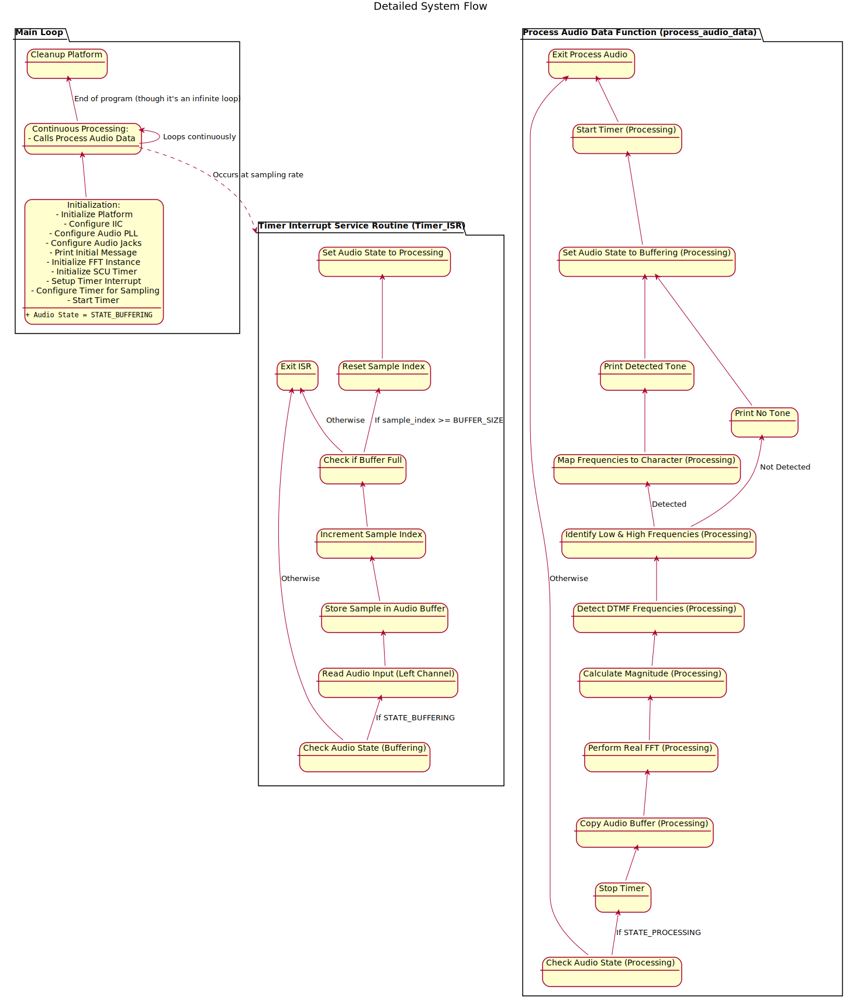

# DTMF OEFENING

## youtube
[DEMO VIDEO](https://www.youtube.com/watch?v=HveD6kOWPNE)

## DTMF generator
De dtmf generator van het project werkt met een timer interupt die aan 8000Hz interupts genereert.
Iedere interupt update vervolgens twee variabelen waarbij de frequentie van beide sinussen wordt gëupdate.
Daarna berekent de interupt routine wat de waarde van beide sinussen opgetelt is.
De bekome waarde wordt dan nog door een moving average filter gehaalt die de slechts de actuele en vorige waarde gebruikt, en zet de uitkomst op de audio poort.

```
//www.cteq.eu
// Timer_ISR for sine generation (no LUT, our processor seems to be fast enough ;-) )
static void Timer_ISR(void *callback_ref)
{
	callback_ref_t *callback = ( callback_ref_t * )callback_ref;

	XScuTimer *timer_instance_ptr = ( XScuTimer * )callback->timer_instance_ptr;
	float32_t frequency1 = *( ( float32_t * )callback->frequency1 );
	float32_t frequency2 = *( ( float32_t * )callback->frequency2 );

	XScuTimer_ClearInterruptStatus( timer_instance_ptr );
	float32_t theta_increment = 2 * PI * frequency1 / SAMPLE_RATE;
	float32_t beta_increment = 2 * PI * frequency2 / SAMPLE_RATE;
	static float32_t theta = 0.0f;
	static float32_t beta = 0.0f;
	static float32_t running_sum = 0.0f;
	static float32_t buffer[AVERAGING_BUFFER_SIZE] = { 0 };
	static uint8_t buffer_counter = 0;
	static unsigned long isr_counter = 0;


	theta += theta_increment ;
	if ( theta > 2* PI)
		theta -= 2* PI;

	beta += beta_increment ;
	if ( beta > 2* PI)
		beta -= 2* PI;

	float32_t sine_value = arm_sin_f32(theta); // CMSIS function
	sine_value += arm_sin_f32(beta);

	running_sum -= buffer[buffer_counter];
	buffer[buffer_counter] = sine_value;
	buffer_counter = ( buffer_counter + 1 ) % AVERAGING_BUFFER_SIZE;
	running_sum += sine_value;

	uint32_t scaled_value = (uint32_t)(((running_sum / AVERAGING_BUFFER_SIZE ) + 1.0f ) * UINT_SCALED_MAX_VALUE);
	Xil_Out32(I2S_DATA_TX_R_REG, scaled_value);
	++isr_counter;

	if (isr_counter == SAMPLE_RATE )
	{
		isr_flag = ( isr_flag % 12 ) + 1;
		isr_counter = 0;
	}
}
```
### notities:
- De moving average filter is in principe overbodig, deze was oorspronkelijk geïmplementeerd voor de lage resolutie ( 8000Hz ) te verbeteren. 
Dit werkte echter niet zoals verwacht, maar is in de code gebleven aangezien deze geen invloed heeft op het uitgangs signaal en er zelfs zorgt dat er "minder ruis" aanwezig is.
- code kan nog versnelt worden met een lut maar dit is niet noodzakelijk. het uitgangsignaal is goed qua vorm en bevat nagenoeg geen ruis.
De lut zou zelfs voor vertraging zorgen bij opstart aangezien de 12 verschillende dtmf tonen elk een eigen array nodig hebben van een paar 1000 samples voor naukeurig genoeg te zijn.

## DTMF analyse
De DTMF filter project demonstreert hoe DTMF-tonen gedetecteerd kunnen worden van een audio_input op een embedded systeem (PYNQ-Z2). 
De code maakt gebruik van een timer-interrupt om audio samples te verzamelen met een frequentie van 8000Hz, voert een Fast Fourier Transform (FFT) uit om de frequentiecomponenten te analyseren, en identificeert de DTMF-tonen op basis van de magnitudes van de verwachte frequenties. De gedetecteerde toon wordt vervolgens als een karakter via de seriële output geprint.

**Belangrijkste functies:**

* **Real-time audio sampling:** Gebruikt een timer-interrupt om audio samples te verzamelen met een sample rate van 8kHz.
* **FFT-analyse:** Past de ARM wiskundebibliotheek toe om een FFT uit te voeren op de audiobuffer, waardoor de frequentiecomponenten zichtbaar worden.
* **DTMF-detectie:** Analyseert de frequentiespectrum om de aanwezigheid van DTMF-toonparen te identificeren op basis van gedefinieerde drempelwaarden.
* **Karaktermapping:** Zet de gedetecteerde DTMF-frequentieparen om naar de corresponderende cijfers ('0'-'9') en symbolen ('\*', '#').
* **Seriële output:** Print de gedetecteerde DTMF-karakters via de seriële interface.

### Architectuur
<!--
```
@startuml FlowChart
allowmixing

title Detailed System Flow

package "Main Loop" {
  state "Initialization:\n- Initialize Platform\n- Configure IIC\n- Configure Audio PLL\n- Configure Audio Jacks\n- Print Initial Message\n- Initialize FFT Instance\n- Initialize SCU Timer\n- Setup Timer Interrupt\n- Configure Timer for Sampling\n- Start Timer" as initialization
  initialization : ""+ Audio State = STATE_BUFFERING""
  state "Continuous Processing:\n- Calls Process Audio Data" as main_loop
  state "Cleanup Platform" as cleanup

  main_loop <-- initialization 
  main_loop <-- main_loop : Loops continuously
  cleanup <-- main_loop : End of program (though it's an infinite loop)
}

package "Timer Interrupt Service Routine (Timer_ISR)" {
  state "Check Audio State (Buffering)" as check_buffering
  state "Read Audio Input (Left Channel)" as read_audio
  state "Store Sample in Audio Buffer" as store_sample
  state "Increment Sample Index" as inc_index
  state "Check if Buffer Full" as check_buffer_full
  state "Reset Sample Index" as reset_index
  state "Set Audio State to Processing" as set_processing
  state "Exit ISR" as exit_isr

  read_audio <-- check_buffering : If STATE_BUFFERING
  exit_isr <-- check_buffering : Otherwise
  store_sample <-- read_audio
  inc_index <-- store_sample
  check_buffer_full <-- inc_index 
  reset_index <-- check_buffer_full : If sample_index >= BUFFER_SIZE
  set_processing <-- reset_index
  exit_isr <-- check_buffer_full : Otherwise
}

package "Process Audio Data Function (process_audio_data)" {
  state "Check Audio State (Processing)" as check_processing_audio
  state "Stop Timer" as stop_timer
  state "Copy Audio Buffer (Processing)" as copy_processing_buffer
  state "Perform Real FFT (Processing)" as rfft_processing
  state "Calculate Magnitude (Processing)" as magnitude_processing
  state "Detect DTMF Frequencies (Processing)" as detect_freq_processing
  state "Identify Low & High Frequencies (Processing)" as identify_processing
  state "Map Frequencies to Character (Processing)" as map_char_processing
  state "Print Detected Tone" as print_detected
  state "Print No Tone" as print_no_tone
  state "Set Audio State to Buffering (Processing)" as set_buffering_processing
  state "Start Timer (Processing)" as start_timer_processing
  state "Exit Process Audio" as exit_process_audio

  stop_timer <-- check_processing_audio : If STATE_PROCESSING
  exit_process_audio <-- check_processing_audio : Otherwise
  copy_processing_buffer <-- stop_timer
  rfft_processing <-- copy_processing_buffer
  magnitude_processing <-- rfft_processing
  detect_freq_processing <-- magnitude_processing
  identify_processing <-- detect_freq_processing
  map_char_processing <-- identify_processing : Detected
  print_detected <-- map_char_processing
  set_buffering_processing <-- print_detected
  print_no_tone <-- identify_processing : Not Detected
  set_buffering_processing <-- print_no_tone
  start_timer_processing <-- set_buffering_processing
  exit_process_audio <-- start_timer_processing
}

main_loop -[dashed]-> "Timer Interrupt Service Routine (Timer_ISR)" : Occurs at sampling rate
@enduml
```
-->



### notities:
- De implementatie van de Hanning-window resulteerde in onverwachte gedrag en de functionaliteit kon niet worden gerealiseerd. 
- Er is ook geen gebruik gemaakt van een moving average filter

Deze toepassingen zouden nog kunnen resulteren in stabielere resultaten. 